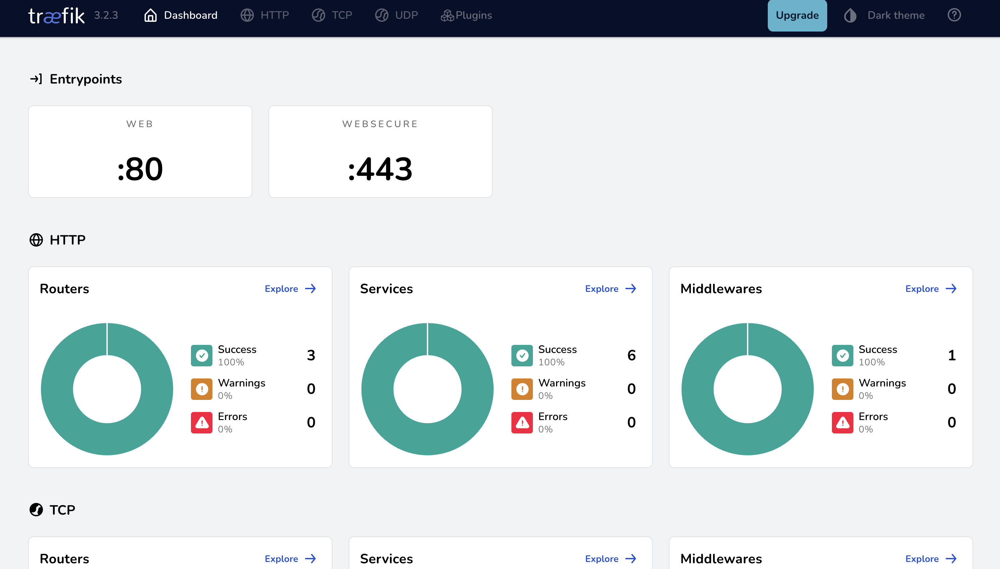
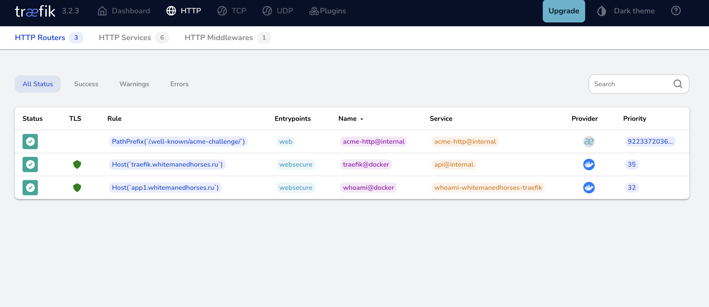
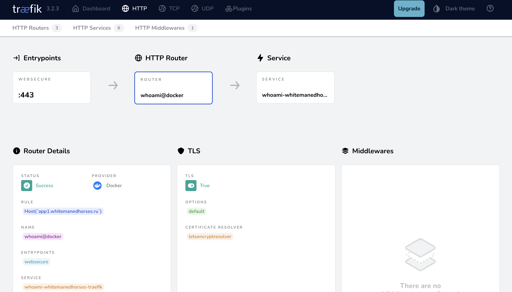
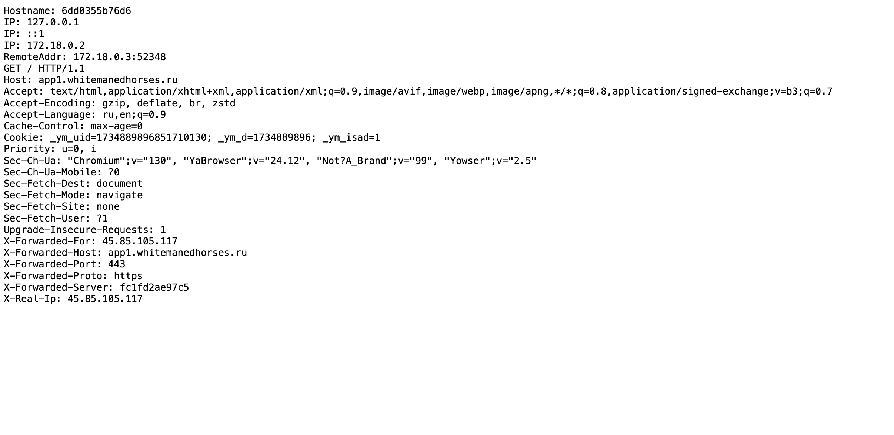

# whitemanedhorses-cloud

## 0 Предварительные условия

1. Наличие публичного домена (для демонстрации используется `whitemanedhorses.ru`).
2. Наличие VDS (для демонстрации была приобретена VDS на reg.ru).
3. Использование дистрибутивов Linux c docker и docker compose (для демонстрации используется Ubuntu 24.04 LTS).
4. Наличие `A` записей у регистраций домена на созданную на публичный адрес VDS:

   - `traefik.whitemanedhorses.ru` -> публичный IP VDS
   - `auth.whitemanedhorses.ru` -> публичный IP VDS
   - `app1.whitemanedhorses.ru` -> публичный IP VDS
   - `app2.whitemanedhorses.ru` -> публичный IP VDS
   - `app3.whitemanedhorses.ru` -> публичный IP VDS

## 1 Развертывание Traefik

Для начала нужно перейти в папку [traefik](./traefik).

### 1.1 Создать общую сеть

В корне папки выполнить команду создания сети:

```bash
docker network create whitemanedhorses
```

Данная сеть необходима для динамического обнаружения маршрутов из docker-контейнеров.

### 1.2 Генерация паролей для дашборды с помощью htpasswd

`htpasswd` - Управление пользовательскими файлами для базовой аутентификации. Он требуется для обеспечения входа в панель управления Traefik по паролю. Для установки выполнить команды:

```
apt update
apt install apache2-utils -y
```

Сгенерировать файл с паролем:

```bash
echo $(htpasswd -nB user) > ./users/passwords
```

Будет создан пользователь `user` с паролем, который будет введен в консоли.

### 1.3 Поднятие контейнеров

Поднять docker compose из папки `traefik`:

```bash
docker compose pull
docker compose up -d
```

### 1.3 Проверка работы Traefik

Открыть в браузере `traefik.whitemanedhorses.ru`.

Ввести логин и пароль, который был установлен на предыдущем шаге.

Откроется dashboard:



Перейти на вкладку HTTP. Откроются текущие доступные маршруты:



Можно увидеть маршрут для `app1.whitemanedhorses.ru`:



Открыть в браузере `app1.whitemanedhorses.ru`. Будет открыта страничка с данными из HTTP заголовка запроса (без авторизации):


