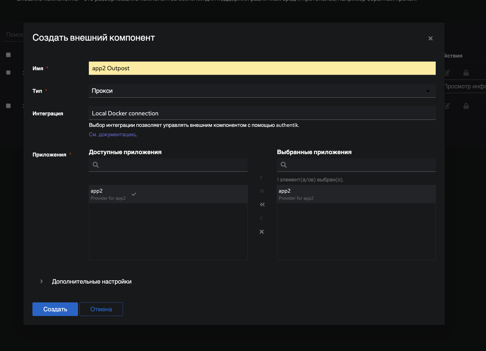

# whitemanedhorses-cloud

## Авторы и вклад

1. Аладина Екатерина @kotyablinov:
   1. Развертывание Traefik
   2. Создание и конфигурирование приложений (`app[1...3]`) и их маршрутов до Traefik.
2. Племяшова Лидия @Plemyashova
   1. Развертывание Authentik
   2. Создание и настройка приложений, управление пользователями в Authentik.

## 0. Предварительные условия

### 0.1. Инфраструктура

1. Наличие публичного домена (для демонстрации используется `whitemanedhorses.ru`).
2. Наличие VDS (для демонстрации была приобретена VDS на reg.ru).
3. Использование дистрибутивов Linux c docker и docker compose (для демонстрации используется Ubuntu 24.04 LTS).
4. Наличие `A` записей у регистраций домена на созданную на публич347334ый адрес VDS:

   - `traefik.whitemanedhorses.ru` -> публичный IP VDS
   - `auth.whitemanedhorses.ru` -> публичный IP VDS
   - `app1.whitemanedhorses.ru` -> публичный IP VDS
   - `app2.whitemanedhorses.ru` -> публичный IP VDS
   - `app3.whitemanedhorses.ru` -> публичный IP VDS

### 0.2. Описание

- `traefik.whitemanedhorses.ru` - панель управления Traefik с авторизацией Basic Auth (по паролю из файла).
- `auth.whitemanedhorses.ru` - единная точка входа Authentik.
- `app1.whitemanedhorses.ru` - [сервис whoami](https://github.com/traefik/whoami) (сервер Go, который выводит информацию об операционной системе и HTTP-запрос на вывод) без авторизации для демонстрации динамической маршутизации Traefik.
- `app2.whitemanedhorses.ru` - сервис с авторизацией с доступом у всех пользователей.
- `app3.whitemanedhorses.ru` - сервис с авторизацией с доступом только у определенной группы пользователей.

## 1. Развертывание Traefik

Команды данного раздела нужно выполнять в папке [traefik](./traefik).

### 1.1. Создать общую сеть

В корне папки выполнить команду создания сети:

```bash
docker network create whitemanedhorses
```

Данная сеть необходима для динамического обнаружения маршрутов из docker-контейнеров.

### 1.2. Генерация паролей для дашборды с помощью htpasswd

`htpasswd` - Управление пользовательскими файлами для базовой аутентификации. Он требуется для обеспечения входа в панель управления Traefik по паролю. Для установки выполнить команды:

```bash
apt update
apt install apache2-utils -y
```

Сгенерировать файл с паролем:

```bash
echo $(htpasswd -nB user) > ./users/passwords
```

Будет создан пользователь `user` с паролем, который будет введен в консоли.

### 1.3. Поднятие контейнеров

Поднять docker compose из папки `traefik`:

```bash
docker compose pull
docker compose up -d
```

### 1.4. Проверка работы Traefik

Открыть в браузере `traefik.whitemanedhorses.ru`.

Ввести логин и пароль, который был установлен на предыдущем шаге.

Откроется панель управления:


Перейти на вкладку HTTP. Откроются текущие доступные маршруты:


Можно увидеть маршрут для `app1.whitemanedhorses.ru`:


Открыть в браузере `app1.whitemanedhorses.ru`. Будет открыта страничка с данными из HTTP заголовка запроса (без авторизации):


## 2. Развертывание Authentik

Команды данного раздела нужно выполнять в папке [authentik](./authentik).

### 2.1. Генерация секретов

Необходимо [сгенерировать секреты](https://docs.goauthentik.io/docs/install-config/install/docker-compose). Находясь в папке `authentik` выполнить команду:

```bash
echo "COMPOSE_PROJECT_NAME=whitemanedhorses-authentik" >> .env
echo "PG_PASS=$(openssl rand -base64 36 | tr -d '\n')" >> .env
echo "AUTHENTIK_SECRET_KEY=$(openssl rand -base64 60 | tr -d '\n')" >> .env
```

### 2.2. Поднятие контейнеров

Поднять docker compose из папки `authentik`:

```bash
docker compose pull
docker compose up -d
```

После поднятия контейнеров в маршрутах Traefik отобразится новый до Authentik:


### 2.3. Первоначальная настройка

Чтобы начать первоначальную настройку, перейдите по ссылке `auth.whitemanedhorses.ru/if/flow/initial-setup/`. Вести почту и логин от аккаунта `akadmin`. Этот пользователь будет администратором по умолчанию.

### 2.4. Проверка работы Authentik

После входа по логину и паролю будет доступен панель управления пользователя:


Панель управления администратора:


## 3. Создание новго приложения app2 в Authentik

Действия далее выполняются в панели управления администратора Authentik.

### 3.1. Создание нового приложения

Перейти в интерфейс администратора. В вкладке приложения открыть страницу "Приложения". Вызвать окно создания приложения, нажав кнопку "Create with Wizard".

Указать имя `app2`, идентификатор `app2` и URL запуска:


На следующей вкладке (нажать далее), выбрать Proxy Provider:


В настройках прокси провайдера выбрать поток авторизации `default-provider-authorization-explicit-consent`, переадресацию аутентификациии (одно приложение) и указать внешний хост:


На остальных вкладках оставить значения по умолчанию. На последней вкладце выбрать "отправить".

### 3.2. Создание внешнего компонента

Перейти в разделе "Приложения" на страницу "Внешние компоненты". Создать компонент, нажав на кнопку "создать".

На форме создания задать необходимые параметры и выбрать приложение `app2`:



### 3.3. Копирование токена AUTHENTIK_TOKEN

Для работы Forward Auth необходимо скопировать значение `AUTHENTIK_TOKEN`. Это можно сделать через действия внешнего компонента:


## 4. Развертывание app2

Команды данного раздела нужно выполнять в папке [app2](./app2).

### 4.1. Генерация секретов

Находясь в папке `app2` выполнить команду:

```bash
echo "COMPOSE_PROJECT_NAME=whitemanedhorses-app2" >> .env
echo "AUTHENTIK_TOKEN=<ТОКЕН ДЛЯ ВНЕШНЕГО КОМПОНЕНТА, ПОЛУЧЕННЫЙ РАНЕЕ ДЛЯ APP2>" >> .env
```

### 4.2. Поднятие контейнеров

Поднять docker compose из папки `app2`:

```bash
docker compose pull
docker compose up -d
```

### 4.3. Проверка приложения app2

Открыть в браузере `app2.whitemanedhorses.ru`. Будет открыта страничка с данными для входа. Если ранее был осуществлен вход в Authentik, то появится следующее уведомление:


Если принять соглашения, то произойдет редирект в приложение `app2`:


## 5. Создание нового пользователя

Действия далее выполняются в панели управления администратора Authentik.

Для демонстрации различных прав доступа, создадим еще одного пользователя.

В интерфейсе администратора в вкладке "Каталог" перейти на страницу "Пользователи". Открыть форму создания пользователя, нажав на кнопку "Создать". Указать данные для нового пользователя: 


Перейти на страницу созданного пользователя и задать пароль:


## 6. Создание новго приложения app3 в Authentik

Действия далее выполняются в панели управления администратора Authentik.

Для начала, требуется повторить все те же действия, что и в разделе 3, только вместо `app2` указывать `app3`.

Далее открыть приложение `app3` со страницы приложений:


Перейти на вкладку "Политика/Пользователь/Пользовательские привязки".

Нажать на кнопку "Создать и привязать политику". Задать политику, которая ограничит доступ к `app3` только для администраторов Authentik:


В результате:

- У администратора по умолчанию будет доступ к приложению `app3`.
- У пользователя, созданного в разделе 5, доступа к приложению не будет.

## 7. Развертывание app3

### 7.1. Генерация секретов

Находясь в папке `app3` выполнить команду:

```bash
echo "COMPOSE_PROJECT_NAME=whitemanedhorses-app3" >> .env
echo "AUTHENTIK_TOKEN=<ТОКЕН ДЛЯ ВНЕШНЕГО КОМПОНЕНТА, ПОЛУЧЕННЫЙ РАНЕЕ ДЛЯ APP3>" >> .env
```

### 7.2. Поднятие контейнеров

Поднять docker compose из папки `app3`:

```bash
docker compose up -d
```

### 7.3. Проверка приложения app3

Открыть в браузере `app3.whitemanedhorses.ru`. Будет открыта страничка с данными для входа. Если ранее был осуществлен вход в Authentik администратором по умолчанию, то появится следующее уведомление:


Если принять соглашения, то произойдет редирект в приложение `app3`. Страница будет аналогична приложению `app2`.

Если был осуществлен вход в Authentik обычным пользователем, то будет отказано в доступе:


## 8. Итоговые маршруты Traefik

В конеченом итоге получим следующие HTTP-маршруты:


## Выводы

// TODO
